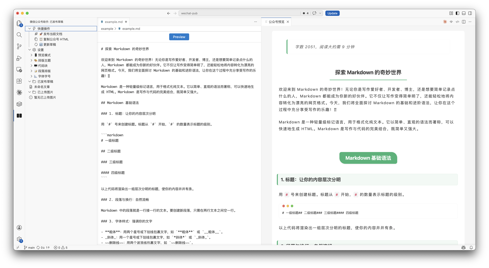

<p align="center">
  
</p>

# vscode-wechat-pub

[](https://marketplace.visualstudio.com/items?itemName=lzjqsdd.vscode-wechat-pub)
[](LICENSE)

VSCode 微信公众号 Markdown 编辑助手，支持实时预览、一键发布、多主题排版、图片上传等功能，让公众号文章写作更高效。

## 功能特性
<p align="center">
  
</p>

### 📝 实时预览
- 编辑 Markdown 时实时预览公众号格式效果
- 支持移动端（375px）和电脑端两种预览模式
- 自动适配 VSCode 深色/浅色主题

### 🎨 多主题排版
- 三种预设主题：经典、优雅、简洁
- 11 种主题色可选 + 自定义颜色
- 10 种代码块高亮主题
- 自定义字体和字号

### 📤 一键发布
- 直接发布到公众号草稿箱
- 支持更新已发布的草稿
- 自动关联本地文件与公众号草稿

### 🖼️ 图片上传
- 本地图片直接上传到公众号
- 自动替换 Markdown 中的图片路径为公众号 URL
- 支持右键菜单快捷上传

### ⚙️ 排版控制
- Mac 风格代码块（三色圆点）
- 代码块行号显示
- 图注格式自定义
- 微信外链转底部引用
- 段落首行缩进 / 两端对齐
- 字数统计和阅读时间

## 安装

### VSCode Marketplace
在 VSCode 扩展市场搜索 "微信公众号助手" 或 "wechat-pub" 安装。

### 手动安装
下载 `.vsix` 文件，在 VSCode 中执行：
```
Extensions: Install from VSIX...
```

## 使用方法

### 1. 配置公众号凭证

在 VSCode 设置中配置公众号 AppID 和 AppSecret：
```json
{
  "wechatPub.appId": "你的AppID",
  "wechatPub.appSecret": "你的AppSecret"
}
```

### 2. 开始写作

打开 Markdown 文件，点击编辑器右上角的 👁️ 公众号预览 按钮，即可实时查看公众号格式效果。

### 3. 发布文章

- **发布到草稿箱**：右键菜单选择"发布到草稿箱"
- **更新草稿**：右键菜单选择"更新草稿"
- **复制 HTML**：右键菜单选择"复制公众号 HTML"，粘贴到公众号编辑器

## 侧边栏功能

插件在左侧活动栏提供快捷操作面板：

- **快捷操作**：发布、复制 HTML、更新草稿
- **设置**：
  - 📱 预览模式（移动端/电脑端）
  - 🎨 排版主题、主题色、代码块主题、图注格式
  - 🖥️ 代码块设置（Mac风格、行号）
  - 📝 段落排版（缩进、对齐、字数统计、外链引用）
  - 📐 字体字号
- **已发布草稿**：查看和管理已发布的草稿列表

## 致谢

本项目核心渲染逻辑和主题样式来源于 [md](https://github.com/doocs/md) 项目，感谢 md 项目作者和贡献者们提供的优秀开源实现。

md 是一个开源的微信公众号 Markdown 编辑器，运行在浏览器端，支持多主题排版、代码高亮、图片上传等功能。本项目将其核心功能移植到 VSCode 插件中，实现了本地编辑与公众号发布的无缝衔接。

如果你喜欢浏览器端的编辑体验，推荐使用 [md 在线版本](https://md.doocs.org)。

## License

[MIT](LICENSE)

## 贡献

欢迎提交 Issue 和 Pull Request！

---

**作者**: [lzjqsdd](https://github.com/lzjqsdd)
**Blog**: [infmax.top](https://infmax.top)